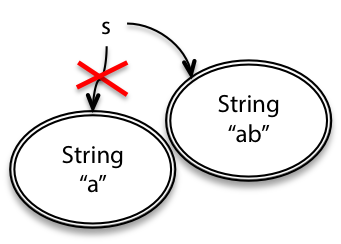
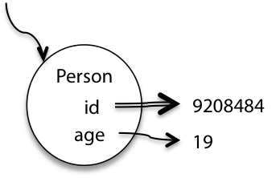
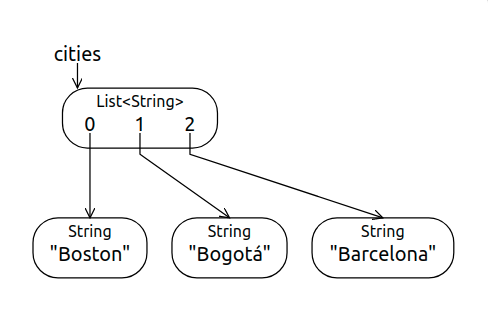
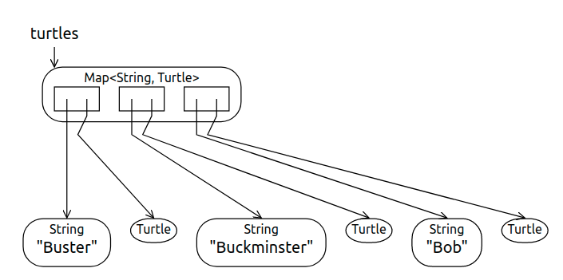
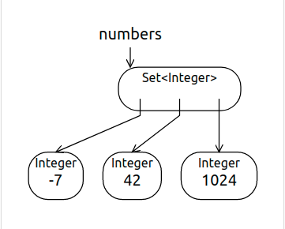
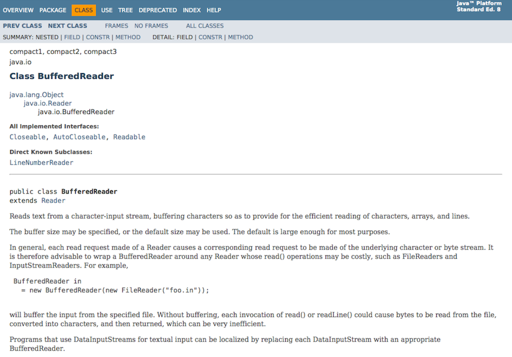
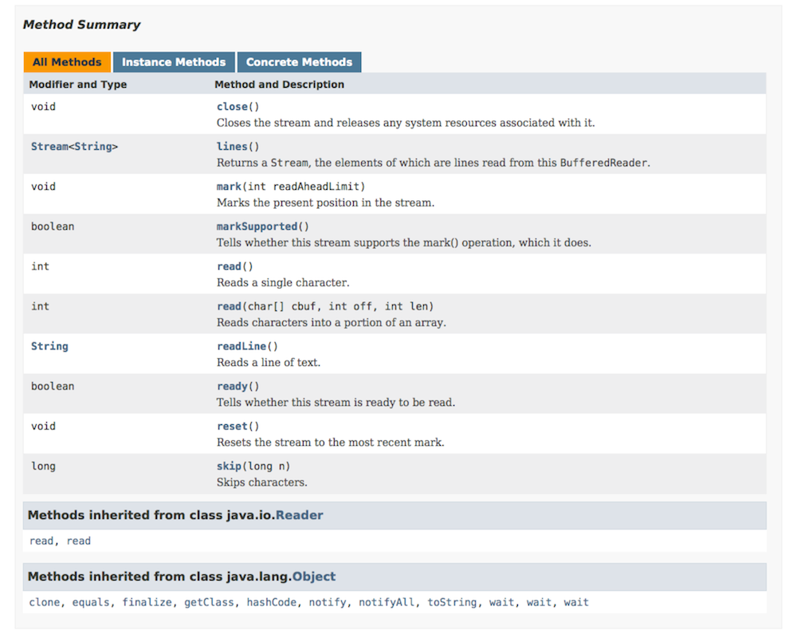

**本文内容来自[MIT_6.031_sp18: Software Construction](http://web.mit.edu/6.031/www/sp18/)课程的Readings部分，采用[CC BY-SA 4.0](http://creativecommons.org/licenses/by-sa/4.0/)协议。**

由于我们学校（哈工大）大二软件构造课程的大部分素材取自此，也是推荐的阅读材料之一，于是打算做一些翻译工作，自己学习的同时也能帮到一些懒得看英文的朋友。另外，该课程的阅读资料中有许多练习题，但是没有标准答案，所给出的答案均为译者所写，有错误的地方还请指出。

<br />

------

<br />

译者：[李秋豪](http://www.cnblogs.com/liqiuhao/) [江家伟](http://jiangjiawei.pw/blog/)

审校：[李秋豪](http://www.cnblogs.com/liqiuhao/)

V1.0 Fri Mar  2 16:48:58 CST 2018

<br />

译者注：本章主要讲解了Java的一些基础知识，以及Python和Java的一些区别与联系，熟悉的读者可以略过本章。

<br />

# Reading 2: Java 基础

#### 本节目标

- 学习Java基本的语法和语义
- 从Python过渡到Java（译者注：MIT是先学的Python）

#### 本课程目标

| 安全健壮性               | 可读性                                         | 可改动性                   |
| ------------------------ | ---------------------------------------------- | -------------------------- |
| 确保现在和将来都是正确的 | 使得未来的阅读者（包括你自己）能够读懂代码意图 | 架构设计应该容许未来的改动 |

<br />

## 开始写Java

阅读 [**From Python to Java**](http://home.wlu.edu/~lambertk/pythontojava/)的前六节 (译者注：这个网站（英文）上详细介绍了Python和Java的异同和注意点，学过Python没学过Java的同学可以认真看一看)：

- 程序的结构与执行
- 数据类型及其表达
- 简单声明
- 终端输入输出
- 控制流
- 对象与接口

<br />

#### 阅读小练习

**语言基础**

下面这块代码取自某一个函数中：

```java
int a = 5;     // (1)
if (a > 10) {  // (2)
    int b = 2; // (3)
} else {       // (4)
    int b = 4; // (5)
}              // (6)
b *= 3;        // (7)
```

哪一行会导致编译时报错？

7

**修改bug**

选择出（多选）最简单能改掉这个bug的操作：

- [x] 在第一行后声明 `int b;` 


- [ ] 在第二行之前赋值 `b = 0;` 
- [x] 第三行改为 `b = 2;` 
- [x] 第五行改为 `b = 4;`
- [ ] 第七行改为声明并赋值 `int b *= 3;`


我们按照上面的修改策略进行了修改，如果我们将`else`块注释掉，会发生什么呢？

- [ ] `b` 为 0
- [ ] `b` 为 3
- [ ] `b` 为 6
- [x] 编译器会报错，在我们运行程序之前
- [ ] 在我们运行程序的时候报错，在我们到达最后一行之前
- [ ] 在我们运行程序的时候报错，在我们到达最后一行的时候


**数字与字符串**

下面这个程序语句将华氏温度转化为摄氏温度，在Python中能得到正确结果吗？

```java
fahrenheit = 212.0
celsius = (fahrenheit - 32) * 5/9
```

- [x] 是

- [ ] 否：整数除法运算会导致摄氏温度变为0

- [ ] 否：整数除法运算会导致摄氏温度被向下取整


如果改用Java写，第一行应该改为（译者注：这里网站上给的是单选，但是译者觉得存在多个答案）:

- [ ] `int fahrenheit = 212.0;`

- [ ] `Integer fahrenheit = 212.0;`

- [ ] `float fahrenheit = 212.0;` 

- [ ] `Float fahrenheit = 212.0;`

- [x] `double fahrenheit = 212.0;`

- [x] `Double fahrenheit = 212.0;`

第二行应该改为（`???`是你上面选择的类型）:

- [x] `??? celsius = (fahrenheit - 32) * 5/9;`

- [ ] `??? celsius = (fahrenheit - 32) * (5 / 9);`

- [x] `??? celsius = (fahrenheit - 32) * (5. / 9);`


应该如何输出？

- [ ] `System.out.println(fahrenheit, " -> ", celsius);`

- [x] `System.out.println(fahrenheit + " -> " + celsius);`

- [ ] `System.out.println("%s -> %s" % (fahrenheit, celsius));`

- [x] `System.out.println(Double.toString(fahrenheit) + " -> " + Double.toString(celsius));`

<br />

## 用快照图理解值与对象

为了弄清楚一些隐秘的问题，我们会画一些图来进行解释。**快照图（Snapshot diagrams）**能代表程序运行时的各种状态——它的栈（即方法和局部变量）和它的堆（即现在存在的对象）。

具体来讲，使用快照图有以下优点：

- 在课堂上和会议上与同学交流
- 解释一些概念例如原始类型 vs. 对象类型不可更改的值 vs. 不可更改的引用, 指针别名, stack栈 vs. 堆heap, 抽象表达 vs. 具体表达.
- 能够帮助你解释你的工程的设计思想
- 为以后的课程做铺垫（例如MIT 6.170中的对象模型）

虽然这些图像都只是解释Java中的一些概念，但是很多都可以延伸到别的现代语言中，例如Python, JavaScript, C++, Ruby.

### 原始值


原始值都是以常量来表达的。上面箭头的来源可以是一个变量或者一个对象的内部区域（field）。

### 对象值


一个对象用一个圆圈表示。对象内部会有很多区域（field），这些区域又指向它们对应的值。同时这些区域也是有它们的类型的，例如`int x` 。

### 可更改的值 vs. 可被重新赋值的改变

通过快照图我们可以视图化可更改的值和可被重新赋值的改变之间的区别：

- 当你给一个变量或者一个区域（filed）赋值的时候，你实际上是改变了它指向的方向，即指向了另一个值。
- 当你修改一个可被更改的（mutable）值的时候——例如数组或者列表——你真正修改了这个值本身（译者注：变量或者区域的指向并没有变）

#### 重新赋值和不可改变的（immutable）值



例如，如果我们有一个 [`String`](http://docs.oracle.com/javase/8/docs/api/?java/lang/String.html) 变量 `s`, 我们可以将它从 `"a"` 赋值为 `"ab"`.

```java
String s = "a";
s = s + "b";
```

`String` 就是一种不可改变的（immutable）值，这种类型的值在第一次确定后就不能改变。不可改变性是我们这门课程的一个重要设计原则，以后的课程中会详细介绍的。

不可更改的对象（设计者希望它们一直是这个值）在快照图中以双圆圈的边框表示，例如上面的字符串对象。

#### 可更改的（mutable）值


与此相对应的， [`StringBuilder`](http://docs.oracle.com/javase/8/docs/api/?java/lang/StringBuilder.html) (Java的一个内置类) 是一个可更改的字符串对象，它内置了许多**改变其内容**的方法：

```java
StringBuilder sb = new StringBuilder("a");
sb.append("b");
```

可更改性和不可更改性（mutability and immutability）将会对我们的“安全健壮性”目标起到重要作用。

#### 不可更改的引用

Java也提供了不可更改的引用：`final`声明，变量一旦被赋值就不能再次改变它的引用（指向的值或者对象）。

```java
final int n = 5;
```



如果Java编译器发现`final`声明的变量在运行中被赋值多次，它就会报错。所以`final`就是为不可更改的引用提供了静态检查。

在快照图中，不可更改的引用（`final`）用双箭头表示，例如上图中的`id`，`Person`的`id`引用不可改变，但是age却是可改变的。

这里要特别注意一点，`final`只是限定了引用不可变，**我们可以将其引用到一个可更改的值** （例如`final StringBuilder sb` ），虽然引用不变，但引用的对象本身的内容可以改变。

同样的，我们也可以将一个可更改的引用作用到一个不可更改的值（例如`String s` ），这个时候变量值的改变就是将引用改变。 

<br />

## Java 聚合类型

阅读 [**From Python to Java**](http://home.wlu.edu/~lambertk/pythontojava/)上的Collections 章节（译者注：英文）。

### 列表、集合、映射（Lists, Sets, and Maps）

**Java中的列表和Python中很相似** 。列表可以包含零个或多个对象，而且对象可以出现多次。我们可以在列表中删除或添加元素。

一些 `List` 常见的操作:

| Java                      | 描述                 | Python             |
| ------------------------- | -------------------- | ------------------ |
| `int count = lst.size();` | 计算列表中元素的个数 | `count = len(lst)` |
| `lst.add(e);`             | 在列表最后添加元素   | `lst.append(e)`    |
| `if (lst.isEmpty()) ...`  | 测试列表是否为空     | `if not lst: ...`  |

在快照图中，我们用数字索引表示列表中的各个区域（filed），例如一个全是String对象的列表：




**Java中的映射和Python中的字典类似** 。在Python中，字典的**keys**必须是 [可哈希的hashable](https://docs.python.org/3/glossary.html#term-hashable) ，Java也是类似。我们会在后面讲解对象对等的时候说这个。

常用的 `Map`操作 :

| Java                   | 描述                 | Python           |
| ---------------------- | -------------------- | ---------------- |
| `map.put(key, val)`    | 添加映射 *key → val* | `map[key] = val` |
| `map.get(key)`         | 获取key映射的值      | `map[key]`       |
| `map.containsKey(key)` | 测试key是否存在      | `key in map`     |
| `map.remove(key)`      | 删除key所在的映射    | `del map[key]`   |

在快照图中，我们将`Map`表示为包含key/value对的对象。例如一个Map\<String, Turtle\> ：



**集合是一种含有零个或多个不重复对象的聚合类型** 。和映射中的key相同，Python中的集合的元素也要求是[可哈希的hashable](https://docs.python.org/3/glossary.html#term-hashable) ，Java也是类似。

常用的 `Set` 操作:

| Java                 | 描述                     | Python                                |
| -------------------- | ------------------------ | ------------------------------------- |
| `s1.contains(e)`     | 测试集合中是否含有e      | `e in s1`                             |
| `s1.containsAll(s2)` | 测试是否 *s1 ⊇ s2*       | `s1.issuperset(s2)` `s1 >= s2`        |
| `s1.removeAll(s2)`   | 在 *s1* 中去除*s2*的元素 | `s1.difference_update(s2)` `s1 -= s2` |

在快照图中，我们不用数字索引表示集合的元素（**即元素没有顺序的概念**），例如一个含有整数的集合：



<br />

### List, Set, and Map的普遍声明方法

Python 提供了创建列表和字典的方便方法：

```python
lst = [ "a", "b", "c" ]
```

```java
dict = { "apple": 5, "banana": 7 }
```

**Java 不是这样 它只为数组提供了类似的创建方法：**

```java
String[] arr = { "a", "b", "c" };
```

我们可以用[the utility function `Arrays.asList`](http://docs.oracle.com/javase/8/docs/api/?java/util/Arrays.html)  从数组创建列表：

```java
Arrays.asList(new String[] { "a", "b", "c" })
```

… 或者直接提供元素:

```java
Arrays.asList("a", "b", "c")
```

要注意的是，如果一个 `List` 是用 `Arrays.asList` 创建的，它的长度就固定了。

在Python中，聚合类中的元素的类型可以不同，但是在Java中，我们能够要求编译器对操作进行静态检查，确保聚合类中的元素类型相同。例如：

```java
List<String> cities;        // a List of Strings
Set<Integer> numbers;       // a Set of Integers
Map<String,Turtle> turtles; // a Map with String keys and Turtle values
```

由于Java要求元素的普遍性，我们不能直接使用原始类型作为元素的类型，例如`Set<int>` ，但是，正如前面所提到的， `int`有一个对应的 `Integer` ”包装“对象类型，我们可以用 `Set<Integer> numbers`.

为了使用方便，Java会自动在原始类型和包装过的对象类型中做一些转换，所以如果我们声明一个 `List<Integer> sequence` ，下面的这个代码也能够正常运行：

```java
sequence.add(5);              // add 5 to the sequence
int second = sequence.get(1); // get the second element
```

### 创建列表：ArrayList 与 LinkedList

我们马上就会看到，Java区分了两个概念：类型的规格说明——它的行为；类型的实现——代码是是什么。

`List`, `Set`, 和 `Map`都是*接口* ：他们定义了类型的工作，但是他们不提供具体的实现代码。这有很多优点，其中一个就是我们能根据具体的环境使用更适合的实现方式。

例如`List`的创建：

```java
List<String> firstNames = new ArrayList<String>();
List<String> lastNames = new LinkedList<String>();
```

如果左右两边的类型参数都是一样的，Java可以自动识别，这样可以少打一些字：

```java
List<String> firstNames = new ArrayList<>();
List<String> lastNames = new LinkedList<>();
```

[`ArrayList`](http://docs.oracle.com/javase/8/docs/api/?java/util/ArrayList.html) 和 [`LinkedList`](http://docs.oracle.com/javase/8/docs/api/?java/util/LinkedList.html) 是实现`List`的其中两种方法。他们都提供的`List`要求的操作，而且这些操作的行为必须和文档规定的相同。在上面的例子中， `firstNames` 和 `lastNames` 的行为一样，也就是说，如果我们在一串代码中将 `ArrayList` vs. `LinkedList`互换，代码依然能够正常工作。

不幸的是，这也是一种负担，既然在Python我们不用关心列表的具体实现，为什么在Java中要关心呢？由于这只会导致程序性能的不同，在本门课程中我们不会做相应的要求。当你不确定时，使用`ArrayList` 。

### 创建集合和映射：HashSets 与 HashMaps

对于集合，我们默认使用[`HashSet`](http://docs.oracle.com/javase/8/docs/api/?java/util/HashSet.html) :

```java
Set<Integer> numbers = new HashSet<>();
```

Java 也提供了 [sorted sets](http://docs.oracle.com/javase/8/docs/api/?java/util/SortedSet.html) ，它是用 [`TreeSet`](http://docs.oracle.com/javase/8/docs/api/?java/util/TreeSet.html) 实现的.

对于映射，我们默认使用 [`HashMap`](http://docs.oracle.com/javase/8/docs/api/?java/util/HashMap.html):

```java
Map<String,Turtle> turtles = new HashMap<>();
```

### 迭代

我们创建了以下聚合类变量:

```java
List<String> cities        = new ArrayList<>();
Set<Integer> numbers       = new HashSet<>();
Map<String,Turtle> turtles = new HashMap<>();
```

一个常见的工作就是遍历这些聚合类中的各个元素。

在Python中，我们可以这么写：

```python
for city in cities:
    print(city)

for num in numbers:
    print(num)

for key in turtles:
    print("%s: %s" % (key, turtles[key]))
```

对于`List` 和 `Set` ，Java提供了类似的语法：

```java
for (String city : cities) {
    System.out.println(city);
}

for (int num : numbers) {
    System.out.println(num);
}
```

我们不能对`Map`进行完全一样的操作，但是我们可以像上面那样遍历它的keys，结合映射对象提供的方法来遍历所有的对（pairs）：

```java
for (String key : turtles.keySet()) {
    System.out.println(key + ": " + turtles.get(key));
}
```

实际上，这个`for`循环用到了 [`Iterator`](http://docs.oracle.com/javase/8/docs/api/?java/util/Iterator.html), 我们会在后续的课程中讲解这种设计。

**警告**: 一定要注意在循环的时候不要改变你的循环参量（他是可改变的值）！添加、删除、或者替换都会影响你的循环甚至中断你的程序，我们会在后面的章节中讲解更多的细节。这对Python也是适用的。例如下面这串代码：

```python
numbers = [100,200,300]
for num in numbers:
    numbers.remove(num) # danger!!! mutates the list we're iterating over
print(numbers) # list should be empty here -- is it?
```

#### 使用数字索引进行迭代

Java也提供了一种使用数字索引进行迭代的方法（译者注：C的标准写法）：

```java
for (int ii = 0; ii < cities.size(); ii++) {
    System.out.println(cities.get(ii));
}
```

除非你真的需要索引ii，否则我们不推荐这种写法，它可能会引来一些难以发现的bug。

<br />

#### 阅读小练习

**聚合类型**

将下面使用数组声明的变量用`List`进行声明（不用初始化）：

`String[] names;` -> `List<String> names;`

`int[] numbers;` -> `List<Integer> numbers;`

`char[][] grid;` -> `List<List<Character>> grid;`

**“找出关键点”**

在运行下列代码后：

```java
Map<String, Double> treasures = new HashMap<>();
String x = "palm";
treasures.put("beach", 25.);
treasures.put("palm", 50.);
treasures.put("cove", 75.);
treasures.put("x", 100.);
treasures.put("palm", treasures.get("palm") + treasures.size());
treasures.remove("beach");
double found = 0;
for (double treasure : treasures.values()) {
    found += treasure;
}
```

以下操作霍变量的值分别为：

`treasures.get(x)` -> 54.0

`treasures.get("x")` -> 100.0

`found` -> 229.0

<br />

## 枚举类型

有时候一种类型中会存在一个既小又有限的不可变的值的集合，例如：

- 一年中的月份： January, February, …, November, December
- 一周中的每一天：Monday, Tuesday, …, Saturday, Sunday
- 指南针中的方向：north, south, east, west
- 可以配出的颜色：black, gray, red, …

当不可变的值的集合满足“小”和“有限”这两个条件时，将这个集合中的所有值统一定义为一个命名常量就是有意义的。在JAVA中，这样的命名常量就称为**enumeration**（枚举类型) 并且使用关键字 `enum` 来构造。

```java
public enum Month { 
    JANUARY, FEBRUARY, MARCH, APRIL, 
    MAY, JUNE, JULY, AUGUST, 
    SEPTEMBER, OCTOBER, NOVEMBER, DECEMBER;
}

public enum PenColor { 
    BLACK, GRAY, RED, PINK, ORANGE, 
    YELLOW, GREEN, CYAN, BLUE, MAGENTA;
}
```

你可以在声明变量或函数的时候使用例如`PenColor`这样的枚举类型名：

```java
PenColor drawingColor;
```

像引用一个被命名的静态常量一样来引用枚举类型的值：

```java
drawingColor = PenColor.RED;
```

需要强调的是，枚举类型是一个独特的新类型。较老的语言，像Python2和java的早期版本，它们倾向于使用数字常量或者字符串来表示这样的值的有限集。但是一个枚举型变量更加“类型安全”，因为它可以发现一些类型错误，如类型不匹配：

```java
int month = TUESDAY;  //  如果month定义为整型值（TUESDAY也是一个整型值），那么这样写不会报错（但是从语义上看是错的，因为显然不能将“周四”赋值给一个“月份”，这可能不符合作者的本意）
Month month = DayOfWeek.TUESDAY; // 如果month被定义为枚举类型Month，那么这条语句将会触发静态错误	 (static error)
```

或者拼写错误：

```java
String color = "REd";        // 不报错，拼写错误被忽略
PenColor drawingColor = PenColor.REd; // 当枚举类型的值被拼写错时，会触发静态错误
```

[Python3 现在也有枚举类型](https://docs.python.org/3.4/library/enum.html), 和java的类似, 但是Python3没有静态类型检查。

<br />

## Java API 文档

在之前的讲义中已经多次使用java类的文档链接，它们都是[Java platform API](http://docs.oracle.com/javase/8/docs/api/)的一部分。

API是 应用编程接口（*application programming interface* ）的简称。比如Facebook开放了一个供你编程的API（实际上不止一个，因为需要对不同的语言和架构开放不同的API），那么你就可以用它来写一个和Facebook交互的应用。

- [**java.lang.String**](http://docs.oracle.com/javase/8/docs/api/?java/lang/String.html) 是 `String`类型的全称。我们仅仅使用`"双引号"`这样的方式就可以创建一个`String`类型的对象。
- [**java.lang.Integer**](http://docs.oracle.com/javase/8/docs/api/?java/lang/Integer.html) 和其他原始包装器类。在多数情况下，Java都会自动地在原始类型（如int）和它们被包装(wrapped，或者称为“封装，boxed”)之后的类型之间相互转换。
- [**java.util.List**](http://docs.oracle.com/javase/8/docs/api/?java/util/List.html) 就像Python中的列表，但是在Python中，列表是语言的一部分。在Java中， `List` 需要用Java来具体实现。
- [**java.util.Map**](http://docs.oracle.com/javase/8/docs/api/?java/util/Map.html) 就像Python的字典。
- [**java.io.File**](http://docs.oracle.com/javase/8/docs/api/?java/io/File.html) 用于表示硬盘上的文件。让我们看看`File`对象提供的方法：我们可以测试这个文件是否可读、删除这个文件、查看这个文件最近一次被修改是什么时候...
- [**java.io.FileReader**](http://docs.oracle.com/javase/8/docs/api/?java/io/FileReader.html) 使我们能够读取文本文件。
- [**java.io.BufferedReader**](http://docs.oracle.com/javase/8/docs/api/?java/io/BufferedReader.html) 让我们高效地读取文本文件。它还提供一个很有用的特性：一次读取一整行。

让我们更深入地看看 [`BufferedReader`](http://docs.oracle.com/javase/8/docs/api/?java/io/BufferedReader.html)的文档。文档中有很多我们还没讨论过的相关Java特性！保持头脑清醒并且将注意力集中在下图展示的信息中。



在这一页的顶部是`BufferedReader`的*继承关系*和一系列已经实现的接口。一个`BufferedReader`对象可以调用这些被列出的类型中定义的所有可用的方法（加上它自己定义的方法）。

接下来会看到它的 *直接子类*，对于一个接口来说就是一个实现类。这可以帮助我们获取诸如[`HashMap`](https://docs.oracle.com/javase/8/docs/api/?java/util/Map.html)是[`Map`](http://docs.oracle.com/javase/8/docs/api/?java/util/Map.html)的直接子类这样的信息。

再往下是**对这个类的描述**。有时候这些描述会有一些模棱两可，但是如果你要了解一个类，这里就是你的**第一选择**。


如果你想创建一个`BufferedReader`，那么**constructor summary**版块就是你要看的资料。构造函数并不是Java中唯一获取一个新对象的方法，但它却是最为普遍使用的。



接下来是`BufferedReader` 对象中**所有我们可以调用的方法的列表**。

在综述下面是每个方法和构造函数的详细描述。**点击一个构造函数或者方法即可看到详细的描述**。如果你想弄明白一个方法有什么作用，那你应该查看这里。

每一个详细描述包括以下内容：

- 方法签名（signature）：我们能看到方法的返回值类型，方法名，以及参数。我们还可以看到一些*异常*，就目前而言，它们就是运行这个方法可能导致的错误。
- 完整的**描述**。
- 参数：描述这个方法接收的参数。
- 对方法返回值的描述。

### 

### 规格说明

这些详细的描述称为  **规格说明**。它们使得我们能够在不了解具体实现代码的情况下使用诸如 `String`, `Map`, 或`BufferedReader` 这样的工具。

读、写、理解和分析这些规格说名将会是我们在课程6.031中的主要内容之一，将会在几节课以后开始讲解。

<br />

#### 阅读小练习

**读Java文档**

阅读Java API文档来回答下列问题：

假设我们有一个 `TreasureChest`类。在我们运行如下代码之后：

```java
Map<String, TreasureChest> treasures = new HashMap<>();
treasures.put("beach", new TreasureChest(25));
TreasureChest result = treasures.putIfAbsent("beach", new TreasureChest(75));
```

 （译者注：`putIfAbsent` ：If the specified key is not already associated with a value (or is mapped to `null`) associates it with the given value and returns `null`, else returns the current value.）

`result`变量的值是什么？

- [x] 25 treasure
- [ ] 75 treasure
- [ ] another amount of treasure
- [ ] `null`

**Avast!**

在运行下面这段代码之后：

```java
Map<String, String> translations = new HashMap<>();
translations.put("green", "verde");
??? result = translations.replace("green", "verde", "ahdar");
```

 `result`的值是什么?（译者注：`replace` ：Replaces the entry for the specified key only if currently mapped to the specified value. `true` if the value was replaced）

- [ ] `"green"`
- [ ] `"verde"`
- [ ] `"ahdar"`
- [ ] `true`
- [ ] `false`
- [ ] `1`
- [ ] `null`
- [x] 以上没有正确答案（译者注：boolean）
