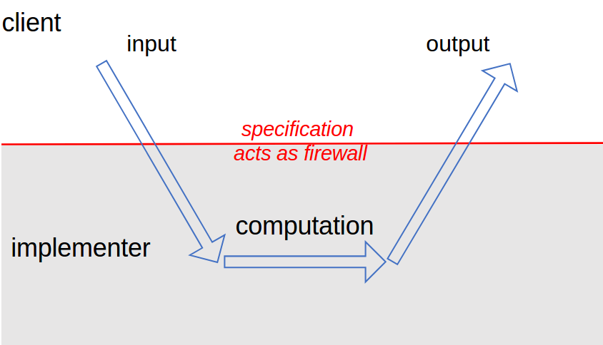
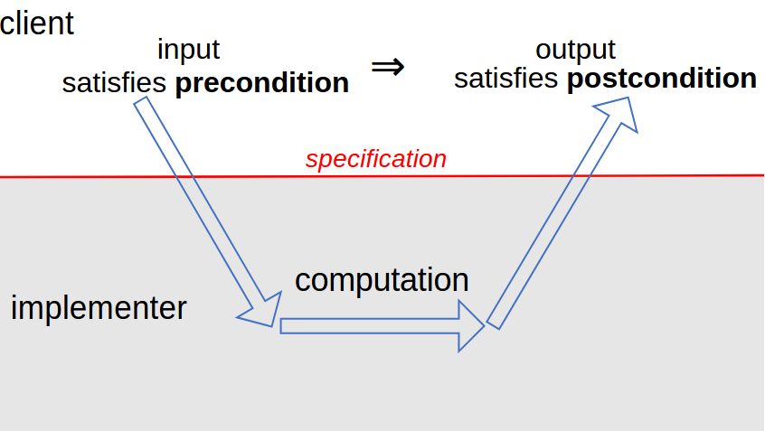
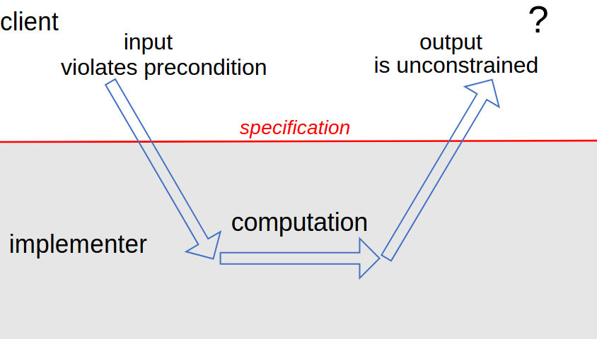
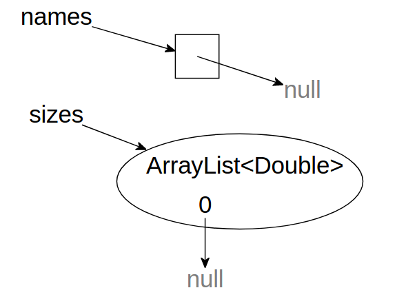
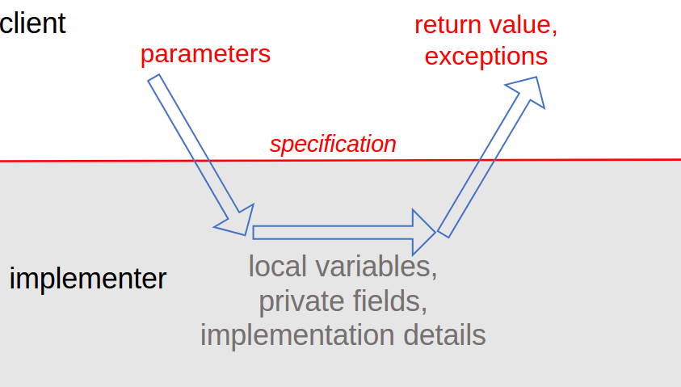
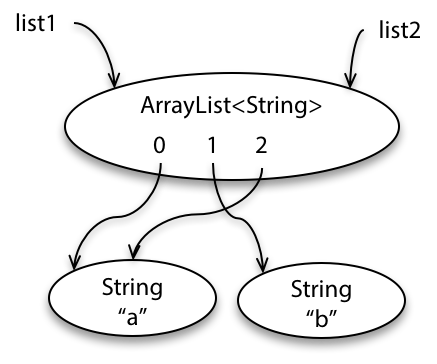
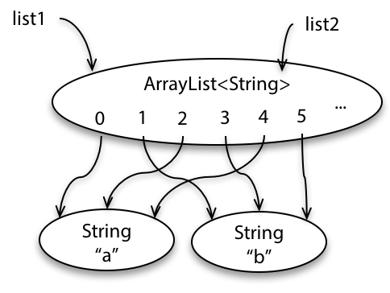
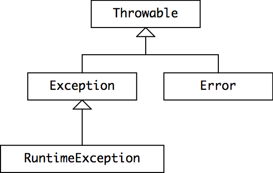

**本文内容来自[MIT_6.031_sp18: Software Construction](http://web.mit.edu/6.031/www/sp18/)课程的Readings部分，采用[CC BY-SA 4.0](http://creativecommons.org/licenses/by-sa/4.0/)协议。**

由于我们学校（哈工大）大二软件构造课程的大部分素材取自此，也是推荐的阅读材料之一，于是打算做一些翻译工作，自己学习的同时也能帮到一些懒得看英文的朋友。另外，该课程的阅读资料中有许多练习题，但是没有标准答案，所给出的答案均为译者所写，有错误的地方还请指出。

<br />

------

<br />

译者：[李秋豪](http://www.cnblogs.com/liqiuhao/)

审校：

V1.0 Tue Mar 13 22:17:35 CST 2018

<br />

#### 本次课程的目标

- 理解方法规格说明中的前置条件和后置条件，并能够写出正确的规格说明
- B能够针对规格说明写出测试
- 理解Java中的检查异常和非检查异常（checked and unchecked exceptions）
- 理解如何用异常处理特殊的结果

### 概要

规格说明是团队合作中的关键点。如果没有规格说明，就没有办法分工实现各种方法。规格说明就像一份合同：实现者的义务在于满足合同的要求，客户可以依赖这些要求工作。事实上，我们会发现就像真的合同一样，规格说明对双方都有制约：当合同上有前置条件时，客户有责任满足这些条件。

在这篇阅读材料中我们会研究方法中的规格说明，讨论前置条件和后置条件分别是什么，它们对方法的实现者和使用者来说意味着什么。我们也会讨论如何使用异常——Java、Python、以及很多现代语言中的一个重要特性，它使得方法的接口更加安全也更加易懂。

<br />

## 为什么要使用规格说明

在编程中，很多让人抓狂的bug是由于两个地方的代码对于接口行为的理解不一样。虽然每一个程序员在心里都有一份“规格说明”，但是不是所有程序员都会把他们写下来。最终，一个团队中的不同程序员对于同一个接口就有不同的“规格说明”了。当程序崩溃的时候，就很难发现问题在哪里。简洁准确的的规格说明使得我们远离bug，更可以快速发现问题所在。

规格说明对使用者（客户）来说也是很有用的，它们使得使用者不必去阅读源码。如果你还不相信阅读规格说明比阅读源码更简单易懂的话，看看下面这个标准的Java规格说明和它对应的源码，它是 [`BigInteger`](http://docs.oracle.com/javase/8/docs/api/?java/math/BigInteger.html) 中的一个方法：

[API 文档中的规格说明](http://docs.oracle.com/javase/8/docs/api/java/math/BigInteger.html#add-java.math.BigInteger-):

```java
public BigInteger add(BigInteger val)

Returns a BigInteger whose value is (this + val).

Parameters: 
val - value to be added to this BigInteger.

Returns: 
this + val
```

[Java 8 中对应的源码](http://hg.openjdk.java.net/jdk8/jdk8/jdk/file/tip/src/share/classes/java/math/BigInteger.java#l1207):

```java
if (val.signum == 0)
    return this;
if (signum == 0)
    return val;
if (val.signum == signum)
    return new BigInteger(add(mag, val.mag), signum);

int cmp = compareMagnitude(val);
if (cmp == 0)
    return ZERO;
int[] resultMag = (cmp > 0 ? subtract(mag, val.mag)
                   : subtract(val.mag, mag));
resultMag = trustedStripLeadingZeroInts(resultMag);

return new BigInteger(resultMag, cmp == signum ? 1 : -1);
```


可以看到，通过阅读 `BigInteger.add` 的规格说明，客户可以直接了解如何使用 `BigInteger.add` ，以及它的行为属性。如果我们去阅读源码，我们就不得不看 `BigInteger` 的构造体， `compare­Magnitude`, `subtract`以及`trusted­StripLeadingZero­Ints` 的实现——而这还仅仅只是开始。

另外，规格说明对于实现者也是很有好处的，因为它们给了实现者更改实现策略而不告诉使用者的自由。同时，规格说明可以限定一些特殊的输入，这样实现者就可以省略一些麻烦的检查和处理，代码也可以运行的更快。



如上图所示，规格说明就好像一道防火墙一样将客户和实现者隔离开。它使得客户不必知道这个单元是如何运行的（不必阅读源码），也使得实现者不必管这个单元会被怎么使用（因为客户要遵守前置条件）。**这种隔离造成了“解耦”（decoupling），客户自己的代码和实现者的代码可以独立发生改动，只要双方都遵循规格说明对应的制约。**

<br />

## 行为等价

思考下面两个方法的异同：

```java
static int findFirst(int[] arr, int val) {
    for (int i = 0; i < arr.length; i++) {
        if (arr[i] == val) return i;
    }
    return arr.length;
}

static int findLast(int[] arr, int val) {
    for (int i = arr.length -1 ; i >= 0; i--) {
        if (arr[i] == val) return i;
    }
    return -1;
}
```

当然，这两个方法的代码是不同的，名字的含义也不一样。为了判断“行为等价”，**我们必须判断一个方法是否可以替换另一个方法，而程序的行为不发生改变。**

除了代码，它们的行为也不一样：

- 当`val`找不到时，`fingFirst`返回`arr`的长度而`findLast`返回-1；
- 当数组中有两个`val`的时候，`findFirst`返回较小的那个索引，而`findLast`返回较大的那个。

但是当`val`在数组中仅有一个的时候，这两个方法的行为是一样的。也只有在这种情况下，我们才可以将方法的实现在两者中互换。

“行为等价”是对于“旁观者”来说的——就是客户。为了让实现方法可以发生改动，我们就需要一个规格说明要求客户遵守某一些制约/前置条件。

所以，我们的规格说明可能是这样的：

```java
static int find(int[] arr, int val)
- requires:
  val occurs exactly once in arr
- effects:
  returns index i such that arr[i] = val

```

#### 阅读小练习

**Behave nicely**

```java
static int findFirst(int[] a, int val) {
    for (int i = 0; i < a.length; i++) {
        if (a[i] == val) return i;
    }
    return a.length;
}
```

```java
static int findLast(int[] a, int val) {
    for (int i = a.length - 1 ; i >= 0; i--) {
        if (a[i] == val) return i;
    }
    return -1;
}
```

假设客户只关心`val`是否在`a`中出现了一次。在这种情况下，`findFirst` 和 `findLast` 的行为等价吗？

Yes


**Best behavior**

现在来改变一下规格说明，假设客户对返回值要求：

- 如果`val`在`a`中，返回任何索引`i` ，使得`a[i] == val` 。
- 否则，返回一个不在`a`索引范围内的整数`j`

在这种情况下，`findFirst` 和 `findLast` 的行为等价吗？

Yes

<br />

## 规格说明的结构

一个规格说明含有以下两个“条款”：

- 一个前置条件，关键词是*requires*
- 一个后置条件，关键词是*effects*

其中前置条件是客户的义务（谁调用的这个方法）。它确保了方法被调用时所处的状态。



而后置条件是实现者的义务。如果前置条件得到了满足，那么该方法的行为应该符合后置条件的要求，例如返回一个合适的值，抛出一个特定的异常，修改一个特定的对象等等。



如果前置条件不满足的话，实现也不需要满足后置条件——方法可以做任何事情，例如不终止而是抛出一个异常、返回一个任意的值、做一个任意的修改等等。

#### 阅读小练习

**Logical implication**

思考下面这个规格说明

```java
static int find(int[] arr, int val)
- requires:
  val occurs exactly once in arr
- effects:
  returns index i such that arr[i] = val

```

作为`find`的实现者，下面哪些行为是合法的？

- [x] 如果`arr`为空，返回0

- [x] 如果`arr`为空，抛出一个异常

- [x] 如果`val`在`arr`出现了两次，抛出一个异常

- [x] 如果`val`在`arr`出现了两次，将`arr`中的元素都设置为0，然后抛出一个异常

- [x] 如果`arr`不为空但是`val`没有出现，选取一个随机的索引，将其对应的元素设置为`val` ，然后返回这个索引

- [x] 如果`arr[0]`是`val` ，继续检查剩下的元素，返回索引最高的那个`val`对饮的索引（没有再次找到`val`就返回0）


**Logical implementation**

作为`find`的实现者，当`arr`为空的时候，为什么要抛出一个异常？

- [ ] DRY（译者注：Don't repeat yourself）
- [x] 快速失败/报错
- [ ] 避免幻数
- [ ] 一个变量只有一个目的
- [ ] 避免全局变量
- [ ] 返回结果


### Java中的规格说明

有一些语言（例如 [Eiffel](http://en.wikipedia.org/wiki/Eiffel_(programming_language)) ），将前置条件和后置条件作为语言的基础之一，以便程序运行的时候（或者编译器）可以自动检查客户和实现者是否都遵循了规格说明。

Java并没有这么严格，但是它的静态检查也是属于一种前置条件和后置条件的检查（编译器）。至于剩下的部分——那些不属于数据类型范畴的约束——必须通过注释写在方法的前面，通过人们来检查和保证。

Java对于 [文档注释](http://en.wikipedia.org/wiki/Javadoc)有一些传统，例如参数的说明以 `@param`作为开头，返回的说明以`@return` 作为开头。你应该将前置条件放在`@param` 的地方，后置条件放在 `@return`的地方。例如，一个规格说明可能是这样：

```java
static int find(int[] arr, int val)
- requires:
  val occurs exactly once in arr
- effects:
  returns index i such that arr[i] = val

```

… 它在Java中可能被注释为这样：

```java
/**
 * Find a value in an array.
 * @param arr array to search, requires that val occurs exactly once
 *            in arr
 * @param val value to search for
 * @return index i such that arr[i] = val
 */
static int find(int[] arr, int val)
```

[Java API 文档](http://docs.oracle.com/javase/8/docs/api/) 就是通过[Java标准库源码](http://hg.openjdk.java.net/jdk8/jdk8/jdk/file/tip/src/share/classes/java)中的规格说明注释生成的. 同样的，Eclipse也可以根据你的规格说明产生对应的文档），或者产生和Java API一个格式的 [HTML 文档](http://help.eclipse.org/oxygen/index.jsp?topic=%2Forg.eclipse.jdt.doc.user%2Freference%2Fref-export-javadoc.htm) ，这对你和你的客户来说都是很有用的信息。

> 参考阅读: 
>
>  Java: [**Javadoc Comments**](http://javaworkshop.sourceforge.net/chapter4.html)
>
> Oracle: [**How to Write Doc Comments**](http://www.oracle.com/technetwork/java/javase/documentation/index-137868.html)

#### 阅读小练习

**Javadoc**

思考以下规格说明：

```java
static boolean isPalindrome(String word)
- requires:
  word contains only alphanumeric characters
- effects:
  returns true if and only if word is a palindrome

```

对应的Javadoc注释：

```java
/*
 * Check if a word is a palindrome.
 * A palindrome is a sequence of characters
 * that reads the same forwards and backwards.
 * @param String word
 * @requires word contains only alphanumeric characters
 * @effects returns true if and only if word is a palindrome
 * @return boolean
 */
```

请问Javadoc中哪一行是有问题的？

- [x] `/*`
- [ ] ` * Check if a word is a palindrome.`
- [ ] ` * A palindrome is a sequence of characters`
- [ ] ` * that reads the same forwards and backwards.`
- [x] ` * @param String word`
- [x] ` * @requires word contains only alphanumeric characters`
- [x] ` * @effects returns true if and only if word is a palindrome`
- [x] ` * @return boolean`
- [ ] ` */`


**Concise Javadoc specs**

思考下面这个规格说明Javadoc，判断每一句的作用（逆序）:

```java
/**
 * Calculate the potential energy of a mass in Earth's gravitational field.
 * @param altitude altitude in meters relative to sea level
 * @return potential energy in joules
 */
static double calculateGravitationalPotentialEnergy(double altitude);
```


`static double calculateGravitationalPotentialEnergy(double altitude);`

- [ ] 前置条件

- [ ] 后置条件

- [x] 是前置条件也是后置条件

- [ ] 都不是

`@return potential energy in Joules`

- [ ] 前置条件

- [x] 后置条件

- [ ] 是前置条件也是后置条件

- [ ] 都不是

`@param altitude altitude in meters relative to sea level`

- [x] 前置条件

- [ ] 后置条件

- [ ] 是前置条件也是后置条件

- [ ] 都不是

`Calculate the potential energy of a mass in Earth's gravitational field.`

- [ ] 前置条件
- [ ] 后置条件
- [ ] 是前置条件也是后置条件
- [x] 都不是


### Null 引用

在Java中，对于对象和数组的引用可以取一个特殊的值`null` ，它表示这个这个引用还没有指向任何对象。Null值在Java类型系统中是一个“不幸的黑洞”。

原始类型不能是`null` ：

```java
int size = null;     // illegal
double depth = null; // illegal
```

我们可以给非原始类型的变量赋予null值：

```java
String name = null;
int[] points = null;
```

在编译期的时候，这是合法的。但是如果你尝试调用这个null对象的方法或者访问它里面对应的数值，发产生一个运行时错误：

```java
name.length()   // throws NullPointerException  
points.length   // throws NullPointerException
```

要注意是，`null`并不等于“空”，例如一个空的字符串`""`或者一个空的数组。对于一个空的字符串或者数组，你可以调用它们的方法或者访问其中的数据，只不过它们对应的元素长度是0罢了（调用 `length()` ）。而对于一个指向null的String类型变量——它什么都不是：调用 `length()` 会产生一个`NullPointer­Exception`.

另外要注意一点，非原始类型的聚合类型例如`List`可能不只想`null`但是它的元素可能指向`null` ：



```java
String[] names = new String[] { null };
List<Double> sizes = new ArrayList<>();
sizes.add(null);
```

如果有人尝试使用这些为`null`的元素，报错依然会发生。

使用Null值很容易发生错误，同时它们也是不安全的，所以在设计程序的时候尽可能避开它们。在这门课程中——事实上在大多数好的Java编程中——**一个约定俗成规矩就是参数和返回值不是null。** 所以每一个方法都隐式的规定了前置条件中数组或者其他对象不能是null，同时后置条件中的返回对象也不会是null值（除非规格说明显式的说明了可能返回null，不过这通常不是一个好的设计）。**总之，避免使用null！**

在Java中你可以在类型中显式的禁用`null` ， 这样会在编译期和运行时[自动检查null值](http://types.cs.washington.edu/checker-framework/)：

```java
static boolean addAll(@NonNull List<T> list1, @NonNull List<T> list2)
```

Google 也对null的使用[进行了一些讨论](https://github.com/google/guava/wiki/UsingAndAvoidingNullExplained)，其中说到：

> 不严谨的使用`null`可以导致各种各样的bug。通过统计Google的代码库，我们发现有95%的聚合类型不应该有任何null值，**如果利用这个性质快速失败**的话比默默接受这些null值更能帮助开发。
>
> 另外，`null`值是有歧义的。通常很难判断一个`null`的返回值意味着什么——例如， `Map.get(key)` 可能在key对应的value是null的时候返回null，也可能是因为value不存在而返回null。null可以意味着失败，也可以意味着成功，它可以是任何东西。**使用非null的值能够使得你的代码更加清晰易懂。**

译者注：*"这是我犯的一个巨大错误"* - [Sir C. A. R. Hoare](http://en.wikipedia.org/wiki/C._A._R._Hoare), null引用的发明者

#### 阅读小练习

**NullPointerException accessing exercise.name()**

下面哪些变量可以是`null` ？

- [ ] `int a;`

- [ ] `char b;`

- [ ] `double c;`

- [x] `int[] d;`

- [x] `String e;`

- [x] `String[] f;`

- [ ] `Double g;`

- [x] `List<Integer> h;`

- [x] `final MouseTrap i;`

- [x] `static final String j;`


**There are null exercises remaining**

```java
public static String none() {
    return null;          // (1)
}

public static void main(String[] args) {
    String a = none();    // (2)
    String b = null;      // (3)
    if (a.length() > 0) { // (4)
        b = a;            // (5)
    }
    return b;             // (6)
}
```

哪一行有静态错误？ -> 6

如果们将上一个问题的行注释掉，然后运行 `main`…

哪一行会有运行时错误？ -> 4


### 规格说明应该说些什么

一个规格说明应该谈到接口的参数和返回的值，但是它不应该谈到局部变量或者私有的（private）内部方法或数据。这些内部的实现应该在规格说明中对读者隐藏。



在Java中，规格说明的读者通常不会接触到实现的源码，应为Javadoc工具通过你的源码自动生成对应的规格说明并渲染成HTML。

<br />

## 测试与规格说明

在测试中，我们谈到了黑盒测试意味着仅仅通过规格说明构建测试，而白盒测试是通过代码实现来构建测试（译者注：[阅读03“测试”](http://www.cnblogs.com/liqiuhao/p/8512205.html)）。但是要特别注意一点：**即使是白盒测试也必须遵循规格说明。** 你的实现也许很依赖前置条件的满足，否则方法就会有一个未定义的行为。而你的测试是不能依赖这种未定义的行为的。测试用例必须尊徐规格说明，就像每一个客户一样。

例如，假设你正在测试`find`，它的规格说明如下：

```java
static int find(int[] arr, int val)
- requires:
  val occurs in arr
- effects:
  returns index i such that arr[i] = val

```

这个规格说明已经很明显的要求了前置条件——`val`必须在arr中存在，而且它的后置条件很“弱”——没有规定返回哪一个索引，如果在`arr`中有多个`val`的话。甚至如果你的实现就是总是返回最后一个索引，你的测试用例也不能依赖这种行为。

```java
int[] array = new int[] { 7, 7, 7 };
assertEquals(0, find(array, 7));  // bad test case: violates the spec
assertEquals(7, array[find(array, 7)]);  // correct

```

类似的，即使你实现的`find`会在找不到`val`的时候抛出一个异常，你的测试用例也不能依赖这种行为，因为它不能在违背前置条件的情况下调用`find()` 。

那么白盒测试意味着什么呢？如果它不能违背规格说明的话？它意味着你可以通过代码的实现去构建不同的测试用例，以此来测试不同的实现，但是依然要检查这些测试用例符合规格说明。

### 测试单元

回想在[阅读03“测试”](http://www.cnblogs.com/liqiuhao/p/8512205.html) 中的web search例子： 

```java
/** @return the contents of the web page downloaded from url */
public static String getWebPage(URL url) { ... }

/** @return the words in string s, in the order they appear,
 *          where a word is a contiguous sequence of
 *          non-whitespace and non-punctuation characters */
public static List<String> extractWords(String s) { ... }

/** @return an index mapping a word to the set of URLs
 *          containing that word, for all webpages in the input set */
public static Map<String, Set<URL>> makeIndex(Set<URL> urls) { 
    ...
    calls getWebPage and extractWords
    ...
} 
```

**一个好的单元测试应该仅仅关注于一个规格说明**。我们的测试不应该依赖于另一个要测试的单元。例如上面例子中，当我们在对 `extractWords` 测试时，就不应该使用`getWebPage` 的输出作为输入，因为如果`getWebPage` 发生了错误， `extractWords` 的行为很可能是未定义的。

而对于一个好的综合测试（测试多个模块），它确保的是各个模块之间是兼容的：调用者和被调用者之间的数据输入输出应该是符合要求的。**同时综合测试不能取代系统的单元测试，因为各个模块的输出集合很可能在输入空间中没有代表性。**例如我们只通过调用 `makeIndex`测试`extractWords ` .而`extractWords `的输出又不能覆盖掉 `makeIndex`的很多输入空间，这样我们以后在别处复用 `makeIndex`的时候，就很可能产生意想不到的错误。

<br />

## 改变对象方法的规格说明

我们在之前的阅读材料中谈到了可改变的对象 vs. 不可改变的对象。但是我们对于`find`的规格说明（后置条件）并没有告诉我们这个副作用——对象的内容被改变了。

以下是一个告诉了这种作用的规格说明，它来自Java中 [`List`](http://docs.oracle.com/javase/8/docs/api/?java/util/List.html)接口：

```java
static boolean addAll(List<T> list1, List<T> list2)
- requires:
  list1 != list2
- effects:
  modifies list1 by adding the elements of list2 to the end of it, and returns true if list1 changed as a result of call

```

首先看看后置条件，它给出了两个限制：`list1`会被更改；返回值是怎么确定的。

再来看看前置条件，我们可以发现，如果我们试着将一个列表加到它本身，其结果是未定义的（即规格说明未指出）。这也很好理解，这样的限制可以使得实现更容易，例如我们可以将第二个列表的元素逐个加入到第一个列表中。如果尝试将两个指向同一个对象的列表相加，就可能发生下图的情况，即将列表2的元素添加到列表1中后同时也改变了列表2，这样方法可能不会终止（或者最终内存不够而抛出异常）：






另外，上文“Null 引用”提到过，这还有一个隐含的前置条件：`list1`和`list2`都不是`null` ，。

这里有另一个改变对象方法的例子：

```java
static void sort(List<String> lst)
- requires:
  nothing
- effects:
  puts lst in sorted order, i.e. lst[i] ≤ lst[j] for all 0 ≤ i < j < lst.size()

```

和一个不改变对象方法的例子：

```java
static List<String> toLowerCase(List<String> lst)
- requires:
  nothing
- effects:
  returns a new list t where t[i] = lst[i].toLowerCase()

```

正如`null`是隐式的不被允许的，我们也隐式的规定**改变对象（mutation）是不被允许的，除非显式的声明** 。例如 `to­Lower­Case` 的规格说明中就没有谈到该方法会不会改变参数对象（不会改变），而`sort`中就显式的说明了。

#### READING EXERCISES阅读小练习

**What’s in a spec?**

下面哪一些选项是属于规格说明的？

- [x] 返回类型

- [x] 返回值的范围

- [x] 参数个数

- [x] 参数种类

- [x] 对参数的限制


**gcd 1**

Alice 写了如下代码：

```java
public static int gcd(int a, int b) {
    if (a > b) {
        return gcd(a-b, b);
    } else if (b > a) {
        return gcd(a, b-a);
    }
    return a;
}
```

Bob 写了如下对应测试：

```java
@Test public void gcdTest() {
    assertEquals(6, gcd(24, 54));
}
```

测试通过了！以下哪些说法是正确的？

Alice 应该在前置条件中加上 `a > 0` -> True

Alice 应该在前置条件中加上 `b > 0` -> True

Alice 应该在后置条件中加上 `gcd(a, b) > 0`  -> False

Alice 应该在后置条件中加上 `a and b are integers`  -> False


**gcd 2**

如果Alice 在前置条件中加上 `a > 0` , Bob 应该测试负数 `a` -> False

如果Alice **没有**在前置条件中加上 `a > 0` , Bob 应该测试负数 `a` -> True

<br />

## 异常

现在我们来讨论一下如何处理异常的情况，并且这种处理既能远离bug又能易于理解。

一个方法的标识（signature）包含它的名字、参数类型、返回类型，同时也包含该方法能触发的异常。

> 参考阅读: [**Exceptions in the Java Tutorials.**](http://docs.oracle.com/javase/tutorial/essential/exceptions/index.html) 

### 报告bug的异常

你可能已经在Java编程中遇到了一些异常，例如 [`ArrayIndex­OutOfBounds­Exception`](http://docs.oracle.com/javase/8/docs/api/?java/lang/ArrayIndexOutOfBoundsException.html) （数组访问越界）或者 [`Null­Pointer­Exception`](http://docs.oracle.com/javase/8/docs/api/?java/lang/NullPointerException.html) （访问一个`null`引用的对象）。这些异常通常都是用来报告你代码里的**bug** ，同时它们报告的信息也能帮助你修复bug。

`ArrayIndex­OutOfBounds-` 和 `Null­Pointer­Exception` 大概是最常见的异常了，其他的例子有：

- [`ArithmeticException`](http://docs.oracle.com/javase/8/docs/api/?java/lang/ArithmeticException.html), 当发生计算错误时抛出，例如除0。
- [`NumberFormatException`](http://docs.oracle.com/javase/8/docs/api/?java/lang/NumberFormatException.html), 数字的类型不匹配的时候抛出，例如你向`Integer.parseInt` 传入一个字符长而不是一个整数。

### 报告特殊结果的异常

异常不仅被用来报告bug，它们也被用来提升那些包含特殊结果的代码的结构。

不幸的是，一个常见的处理特殊结果的方法就是返回一个特殊的值。你在Java库中常常能发现这样的设计：当你期望一个正整数的时候，特殊结果会返回一个-1；当你期望一个对象的时候，特殊结果会返回一个`null` 。这样的方法如果谨慎使用也还OK，但是它有两个问题。首先，它加重的检查返回值的负担。其次，程序员很可能会忘记检查返回值（我们待会会看到通过使用异常，编译器会帮助你处理这些问题）。

同时，找到一个“特殊值”返回并不是一件容易的事。现在假设我们有一个 `BirthdayBook` 类，其中有一个`lookup`方法：

```java
class BirthdayBook {
    LocalDate lookup(String name) { ... }
}
```

([`LocalDate`](http://docs.oracle.com/javase/8/docs/api/?java/time/LocalDate.html) 是Java API的一个类.)

如果name在这个BirthdayBook中没有入口，这个方法该如何返回呢？或许我们可以找一个永远不会被人用到的日期。糟糕的程序员或许会选择一个9/9/99，毕竟他们觉得没有人会在这个世纪结束的时候使用这个程序。（([事实上，它们错了](http://en.wikipedia.org/wiki/Year_2000_problem)）

这里有一个更好的办法，就是抛出一个异常：

```java
LocalDate lookup(String name) throws NotFoundException {
    ...
    if ( ...not found... )
        throw new NotFoundException();
    ...
```

调用者使用`catch`捕获这个异常：

```java
BirthdayBook birthdays = ...
try {
    LocalDate birthdate = birthdays.lookup("Alyssa");
    // we know Alyssa's birthday
} catch (NotFoundException nfe) {
    // her birthday was not in the birthday book
}
```

现在我们就不需要使用“特殊”的返回值来通报特殊情况了，调用者也不需要再检查返回值。

#### 阅读小练习

**1st birthday**

假设我们在使用 `BirthdayBook` 中的 `lookup` 方法，它可能会抛出 `NotFoundException`.

如果“Elliot”不在birthdays里面（birthdays已经初始化了，并指向了一个对象），下面这些代码会发生什么？

```java
try {
    LocalDate birthdate = birthdays.lookup("Elliot");
}
```

运行时报错: NotFoundException


**2nd birthday**

```java
try {
    LocalDate birthdate = birthdays.lookup("Elliot");
} catch (NotFoundException nfe) {
    birthdate = LocalDate.now();
}
```

静态错误: undeclared variable


**3rd birthday**

```java
try {
    LocalDate birthdate = birthdays.lookup("Elliot");
} catch (NotFoundException nfe) {
    throw new DateTimeException("Missing reference birthday", nfe);
}
```

([`DateTimeException`](http://docs.oracle.com/javase/8/docs/api/?java/time/DateTimeException.html) is provided by the Java API.)

运行时报错: DateTimeException

<br />

## 已检查（Checked）异常和未检查（Unchecked）异常

我们已经看到了两种不同目的的异常：报告特殊的结果或者报告bug。一个通用的规则是，我们用已检查的异常来报告特殊结果，用未检查的异常来报告bug。在后面一节中，我们会详细介绍一些。

“ *已检查* 异常”这个名字是因为编译器会检查这种异常是否被正确处理：

- 如果一个方法抛出一个已检查异常，这种可能性必须添加到它的标识中。例如 `Not­Found­Exception`就是一个已检查异常，这也是为什么它的生命的结尾有一个 `throws Not­Found­Exception`.
- 如果一个方法调用一个可能抛出已检查异常的方法，该方法要么处理它，要么在它的标识中说明该异常（交给它的调用者处理）。

所以如果你调用了 `BirthdayBook`中的 `lookup` 并忘记处理 `Not­Found­Exception` ，编译器就会拒绝你的代码。这非常有用，因为它确保了那些可能产生的特殊情况（异常）被处理。

相应的，*未检查*异常用来报告bug。这些异常并不指望被代码处理（除了一些顶层的代码），同时这样的异常也不应该被显式抛出，例如边界溢出、null值、非法参数、断言失败等等。同样，编译器不会检查这些异常是否被 `try`-`catch` 处理或者用 `throws` 抛给上一层调用者。（Java允许你将未检查的异常作为方法的标识，不过这没有什么意义，我们也不建议这么做）

异常中有可能有和异常相关的信息。（如果构建体没有提供，引用这个信息（String）的值将会是`null` ）

### Throwable 类层次

为了理解Java是如何定义一个异常是已检查还是未检查的，让我们看一看Java异常类的层次图：



[`Throwable`](http://docs.oracle.com/javase/8/docs/api/?java/lang/Throwable.html) 是一个能够被抛出和捕获的对象对应的类。`Throwable`的实现记录了栈的结构（异常被抛出的时候），同时还有一个描述该异常的消息（可选）。**任何被抛出或者捕获的异常对象都应该是 `Throwable`的子类。**

[`Error`](http://docs.oracle.com/javase/8/docs/api/?java/lang/Error.html) 是 `Throwable` 的一个子类，它被保留用于**Java运行系统**的异常，例如 [`StackOverflow­Error`](http://docs.oracle.com/javase/8/docs/api/?java/lang/StackOverflowError.html) 和 [`OutOfMemory­Error`](http://docs.oracle.com/javase/8/docs/api/?java/lang/OutOfMemoryError.html).Errors**应该被认为是不可恢复的，并且一般不会去捕获它。**（这里有一个特例， [`Assertion­Error`](http://docs.oracle.com/javase/8/docs/api/?java/lang/AssertionError.html) 也是属于[`Error`](http://docs.oracle.com/javase/8/docs/api/?java/lang/Error.html) 的，即使它反映的是用户代码错误）

下面描述了在Java中如何区别已检查异常和未检查异常：

- `RuntimeException`, `Error`, 以及它们的子类都是未检查异常。编译器不会要求它们被`throws`修饰，也不会要求它们被捕获。
- 所有其他的throwables—— `Throwable`, `Exception`和其他子类都是已检查异常。编译器会要求它们被捕获或者用`throws`传给调用者处理。

当你定义你自己的异常时，你应该使它要么是 `RuntimeException` 的子类（未检查异常），要么是 `Exception` 的子类（已检查异常）。程序员通常不会生成 `Error` 或者 `Throwable`的子类，因为它们通常被Java保留使用。

#### 阅读小练习

**Get to the point**

假设我们写了一个寻找两点之间路径的方法：

```java
public static List<Point> findPath(Point initial, Point goal)
```

In the postcondition, we say that `findPath` will search for paths only up to a bounded length (set elsewhere), and that it will throw an exception if it fails to find one.在前置条件中，我们要求`findPath` 搜索的范围是有限的（有边界）。如果该方法没有找到一个路径，它就会抛出一个异常。

在设计方法时，以下哪一个异常是合理的？

- [ ] 已检查异常 `NoPathException`
- [ ] 未检查异常 `NoPathException`
- [x] 已检查异常 `PathNotFoundException`
- [ ] 未检查异常 `PathNotFoundException`

**Don’t point that thing at me**

当我们定义该异常时，应该使它是哪一个类的子类？ 

- [ ] `Throwable`
- [x] `Exception`
- [ ] `Error`
- [ ] `RuntimeException`

<br />

## 设计异常时应该考虑的事情

我们之前给了一个通用规则——对于特殊的结果（预测到的）使用已检查异常，对于bug使用未检查异常（意料之外）。这说得通，不过，在Java中异常并没有这么“轻量化”。

除了对性能有影响，Java中的异常会带来使用上的开销：如果你要设计一个异常，你必须创建一个新的类。如果你调用一个可能抛出已检查异常的方法，你必须使用 `try`-`catch` 处理它（即使你知道这个异常一定不会发生）。后一种情况导致了一个进退两难的局面。例如，你设计了一个抽象队列，你是应该期望使用者在循环pop的时候检查队列是否为空（作为前置条件），还是让使用者自由的pop，最后抛出一个异常呢？如果你选择抛出异常，那么即使使用者每次都检查队列不为空才pop，他还是要对这个异常进行处理。

所以我们提炼出另一个明确的规则：

- 对于意料之外的bug使用未检查的异常，或者对于使用者来说避免异常产生的情况非常容易（例如检查一个队列是否为空）。
- 其他的情况我们使用已检查异常。

这里举出一些例子：

- 当队列是空时，`Queue.pop()` 会抛出一个未检查异常。因为检查队列是否为空对于用户来说是容易的。（例如 `Queue.size()` or `Queue.isEmpty()`.）
- 当无法连接互联网时，`Url.getWebPage()` 抛出一个已检查异常 `IOException` ，因为客户可能无法确定调用的时候网络是否好使。
- 当`x`没有整数开方时，`int integerSquareRoot(int x)` 抛出一个已检查异常 `Not­Perfect­Square­Exception` ，因为对于调用者来说，判断一个整数是否为平方是困难的。

这些使用异常的“痛楚”也是很多Java API使用null引用或特殊值作为返回值的原因。额.....如果你严谨认真的使用这些返回值，这也不是什么糟糕的事情。

### 在规格说明中应该如何声明异常

因为异常也可以归为方法的输出，所以我们应该在规格说明的后置条件中描述它。Java中是以 `@throws` 作为Javadoc中异常注释的。Java也可能要求函数声明时用`throws`标出可能抛出的异常 。这一节会讨论什么时候使用这两种方法。

对于非检查的异常，由于它们描述的是意料之外的bug或者失败，不属于后置条件，所以不应该用 `@throws` 或 `throws`修饰它们。例如， `NullPointerException`就不应该在规格说明中列出——我们的前置条件已经隐式（显式）的禁止了null值，这意味着如果使用者传入一个null，我们可以没有任何警告的扔出一个异常。例如下面这个规格说明，就没有提到 `NullPointerException` ：

```java
/**
 * @param lst list of strings to convert to lower case
 * @return new list lst' where lst'[i] is lst[i] converted to lowercase
 */
static List<String> toLowerCase(List<String> lst)
```

而对于报告特殊结果的异常，我们应该在Javadoc中用 `@throws` 表示出来，并明确什么情况下会导致这个异常的抛出。另外，如果是一个已检查异常，Java会要求在函数声明的时候用 `throws` 标识出来。例如，假设 `NotPerfectSquareException` 是一个已检查声明：

```java
/**
 * Compute the integer square root.
 * @param x value to take square root of
 * @return square root of x
 * @throws NotPerfectSquareException if x is not a perfect square
 */
int integerSquareRoot(int x) throws NotPerfectSquareException;
```

对于报告特殊结果的未检查异常，Java允许但是不要求使用 `throws` 在声明中标识出。但是这种情况下通常不要使用 `throws` 因为这会使得阅读者困惑（以为它是一个已检查异常）。例如，假设你将`EmptyQueueException`定义为未检查异常。那么你应该在Javadoc中使用 `@throws`对其进行说明，但是不要在函数声明中将其标识出：

```java
/**
 * Pops a value from this queue.
 * @return next value in the queue, and removes the value from the queue
 * @throws EmptyQueueException if this queue is empty
 */
int pop();
```

#### 阅读小练习

**Throw all the things!**

阅读以下代码并分析 `Thing` 对象:

```java
static Set<Thing> ALL_THE_THINGS;

static void analyzeEverything() {
    analyzeThingsInOrder();
}

static void analyzeThingsInOrder() {
    try {
        for (Thing t : ALL_THE_THINGS) {
            analyzeOneThing(t);
        }
    } catch (AnalysisException ae) {
        return;
    }
}

static void analyzeOneThing(Thing t) throws AnalysisException {
    // ...
    // ... maybe go off the end of an array
    // ...
}
```

`AnalysisException` 是一个 **已检查** 异常.

`analyzeEverything`可能会抛出哪一些异常？

- [x] `ArrayIndexOutOfBoundsException`

- [ ] `IOException`

- [x] `NullPointerException`

- [ ] `AnalysisException`

- [ ] `OutOfMemoryError`


**A terrible thing**

如果 `analyzeOneThing` 自己会抛出一个 `AnalysisException` 异常，会发生什么？

- [ ] 程序可能会崩溃

- [x] 我们可能不能调用任何 `analyzeOneThing`

- [ ] 我们可能会调用几次 `analyzeOneThing` 


<br />

- ## 总结

  最后，再做一组练习看看你对今天学的内容理解的如何。

  #### 阅读小练习

  **拼字游戏 1**

  ```java
  // Requires: tiles has length 7 & contains only uppercase letters.
  //           crossings contains only uppercase letters, without duplicates.
  // Effects: Returns a list of words where each word can be made by taking
  //          letters from tiles and at most 1 letter from crossings.
  public static List<String> scrabble(String tiles, String crossings) {
      if (tiles.length() != 7) { throw new RuntimeException(); }
      return new ArrayList<>();
  }
  ```

  `scrabble`的后置条件有哪些?

  - [ ] `tiles` 中只有大写字母
  - [ ] `crossings` 中字母没有重复
  - [ ] `scrabble` 需要两个参数
  - [x] `scrabble` 返回字符串列表

  `scrabble`的前置条件有哪些?

  - [x] `tiles` 长度为 7
  - [x] `crossings` 是一个大写的字符串
  - [x] `scrabble`参数的类型是 `String` 和 `String`
  - [ ] `scrabble` 返回一个空的 `ArrayList`

  **拼字游戏 2**

  规格说明中的哪一部分是会被静态检查的？

  - [ ] `tiles` 中只有大写字母
  - [ ] `crossings` 中字母没有重复
  - [ ] 当 `tiles.length() != 7`, `scrabble` 抛出 `RuntimeException`
  - [x] `scrabble` 接收两个参数

   `scrabble` 的实现满足了规格说明吗？

  - [ ] 是
  - [ ] 否, 因为它会在无法获取`tiles`长度时抛出 `RuntimeException`
  - [x] 否，因为即使我们传入一个可以组合成词的tiles和crossings，它也会返回一个空列表。

  一个规格说明就好像是实现者和使用者之间的防火墙。它使得分别开发成为可能：使用者可以在不理解源代码的情况下使用模块，实现者可以在不知道模块如何被使用的情况下实现模块。

  现在让我们想想今天的内容和我们三大目标之间的联系：

  - **远离bug**. 一个好的规格说明会清晰明确的要求实现者和使用者遵守相关的制约。而Bug经常是因为实现者和使用者对于接口的理解冲突导致的，规格说明会明显的减小这种可能性。在模块中使用一些能够交由机器检查的特性，例如静态检查、异常等而不是注释会进一步降低bug的可能性。
  - **易读性**. 一个简洁准确的规格说明会比源代码本身更易读易懂。
  - **可改动性**. 规格说明在实现者和使用者之间建立了一个“契约”——只要这两方遵守这份“契约”，他们可以对自己的代码进行任何改变。